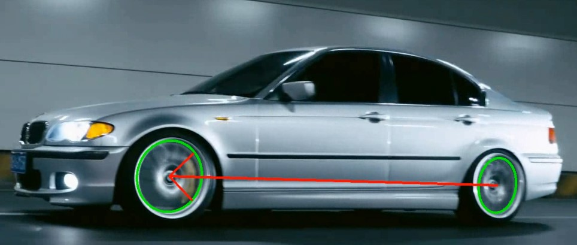

# Vehicle Orientation Detection (Based on YOLOv5)

 

YOLOv5: [ultralytics/yolov5: YOLOv5 🚀 in PyTorch > ONNX > CoreML > TFLite](https://github.com/ultralytics/yolov5)

## 🌍 Documentation Languages

- 🇺🇸 [English (this file)](./README.md)
- 🇨🇳 [简体中文 (readme_ch-CN.md)](./readme.zh-CN.md)


A vehicle-orientation detection system based on YOLOv5 for real-time vehicle location detection. It uses the relative location of tires to obtain the direction. The code is compatible with PyTorch 1.7+ and supports GPU acceleration.

Due to various objective factors and the author's own limitations in coding ability, please forgive any shortcomings. Your valuable suggestions for improvement are sincerely hoped for.

**!!!****Disclaimer:** The functionalities provided by this project have not been fully tested. The authors do not take any responsibility for issues arising from its use**!!!**

## 🚀 Major Functions
- ✅ **Vehicle detection**: High quality YOLOv5 object detection.
- 🧭 **Orientation**: Method of detecting orientations of complex objects based on key points.
- 📊 **Visualized output**: Output marked with ellipses and arrow lines.

## 📦 Quick start

### Environment
```bash
# clone project
git clone https://github.com/Steven8686/vehicle_orientation_detect.git
cd vehicle-orientation-detection

# installation (Python 3.8+)
pip install -r requirements.txt
```

### Model test

```bash
python detect.py --weights ./orientation/vehicle_orientation.pt  --img 640 --conf 0.25 --source ./orientation/test_picture/test.jpg --ori_mode e-lsm
```

pre-trained model (based on dataset of our own) is saved as ./orientation/vehicle_orientation.pt

## Parameters

This project has **3** more parameters compared to original YOLOv5. Description: (original parameters of YOLOv5 are not mentioned here)

```bash
--ori_mode  # Modes for ellipses(tires) detection, Including "e-lsm", "lsm", "e-hough", "hough",default="e-lsm"
--ori_detect  # Enables orientation detection. If False, there's no difference between original yolov5 for detect.py
--ori_savepath  # Save path for orientation detection. Default=runs/detect/expx/orientation.jpg/mp4.
```


## Extra information

In this version, due to some historic reasons, classes.txt (./orientation/classes.txt) defined 6 categories, representing:

| label | meaning                                                      |
| :---- | :----------------------------------------------------------- |
| sr    | static right (static tires on the right side of vehicle, usually back wheel) |
| mr    | movable right (movable tires on the right side of vehicle, usually front wheel) |
| ml    | movable left                                                 |
| sl    | static left                                                  |
| l     | left (Left side of vehicle)                                  |
| r     | right (Right side of vehicle)                                |

In fact, 3 categories (car, front, back) are enough for detection. Currently used 6 categories have decreased the accuracy of YOLO detection and resulted in duplicate detections. We plan to correct and optimize this problem later.

## Future Plans

- Modify the way of labeling data and correspondent code.
- Optimize the save process and keep it the same as original YOLOv5.
- Optimize the tire detection logic. Plan to add a direct way of plotting the arrow using the detection boxes as well as optimize performance.
