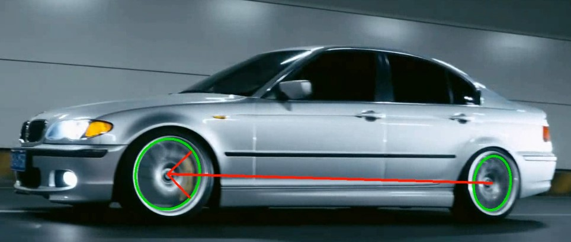

# Vehicle Orientation Detection (基于YOLOv5改进)

 

YOLOv5模型地址: [ultralytics/yolov5: YOLOv5 🚀 in PyTorch > ONNX > CoreML > TFLite](https://github.com/ultralytics/yolov5)

- 🇺🇸 [English ](./README.md)
- 🇨🇳 [简体中文 (本文件)](./readme.zh-CN.md)

一个基于YOLOv5模型改进的车辆朝向检测系统，支持实时检测车辆位置并根据轮胎的连线得到车辆的行驶方向。代码兼容PyTorch 1.7+，支持GPU加速。

本项目是作为课程大作业完成的，受各种客观因素和作者本人水平的限制，不足之处请予以谅解，希望您能提出宝贵的修改意见。

**!!!**本项目的各种功能没有得到完整的测试，对使用过程中产生的问题概不负责**!!!**

## 🚀 主要功能
- ✅ **车辆检测**：高精度YOLOv5目标检测
- 🧭 **朝向预测**：基于特殊物体特征点检测的朝向计算方法
- 📊 **可视化输出**：带方向箭头的标注结果

## 📦 快速开始

### 环境安装
```bash
# 克隆项目
git clone https://github.com/Steven8686/vehicle_orientation_detect.git
cd vehicle-orientation-detection

# 安装依赖 (Python 3.8+)
pip install -r requirements.txt
```

### 模型测试

```bash
python detect.py --weights ./orientation/vehicle_orientation.pt  --img 640 --conf 0.25 --source ./orientation/test_picture/test.jpg --ori_mode e-lsm
```

预训练模型（基于本组的数据集）保存为 ./orientation/vehicle_orientation.pt

## 参数说明

此项目相较于原yolov5添加了三个参数，描述如下（yolov5原本的参数此处不再赘述）

```bash
--ori_mode  # 椭圆(轮胎)检测的模式，可选项为 "e-lsm", "lsm", "e-hough", "hough"，默认为"e-lsm"
--ori_detect  # 是否进行朝向检测，若为False，则detect.py与原yolov5没有区别
--ori_savepath  # 检测后生成的图片/视频的保存位置.默认为runs/detect/expx/orientation.jpg/mp4,即保存在yolov5默认的保存路径
```

## 📚 数据集说明

本模型使用的训练数据集通过以下流程构建：
- 使用Python爬虫从公开网络资源获取原始车辆图片
- 采用labelImg脚本手动标注关键特征点
- 最终标注数据集约600张图片（包含车辆位置、轮胎及车身关键点）

尽管数据规模有限，但模型经过优化后仍能实现：
- 视频流实时识别（≥25 FPS，依赖硬件配置）
- 对不同光照和角度的车辆朝向保持鲁棒性

## 额外说明

在当前版本中，由于数据标注过程的历史遗留原因，classes.txt (./orientation/classes.txt)中包含了六个类别，分别代表如下含义：

| label | meaning                              |
| :---- | :----------------------------------- |
| sr    | static right (固定右轮，通常是后轮)  |
| mr    | movable right (可动右轮，通常是前轮) |
| ml    | movable left (可动左轮)              |
| sl    | static left (可动右轮)               |
| l     | left (车辆的左边)                    |
| r     | right (车辆的右边)                   |

显然的，我们实际上只需要车辆本身和前后轮的位置即可，完全没有必要区分其左右。这一区分使得yolo检测的准确度下降，同时带来了重复检测的问题。计划将在以后的版本中更正这一问题，将其类别改为car, frt, bak 三个类别，同时修改相应的代码。

## 计划完成

- 数据标注方式及相应代码的修改.
- 优化输出结果保存方式，与YOLO原本的保存逻辑保持一致.
- 优化轮胎检测逻辑，加入直接使用检测框进行绘制的功能，同时提高性能.
